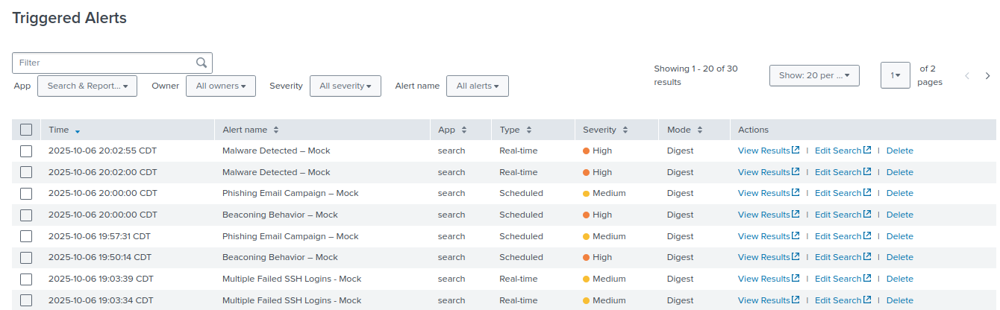

# SOC Incident Triage Reports – Mock Project

---

## Overview
This project showcases **realistic SOC triage documentation** — the kind of work analysts handle every day when responding to alerts, investigating anomalies, and determining whether something is truly a threat or just noise.  

While my previous projects focused on larger-scale SOC automation, scripting, and detection engineering, this one highlights the **hands-on, investigative side** of the role — the part that defines an analyst’s technical judgment and attention to detail.

---

## Objective
To present a realistic portfolio demonstrating:
- Hands-on experience with **alert triage and initial investigation**  
- Familiarity with **SOC processes, tools, and terminology**  
- The ability to differentiate between **True Positives, False Positives, and True Negatives**  
- Clear, structured **documentation standards** that reflect professional SOC workflows  

Each report reflects how a real analyst would handle an alert — verifying data, correlating evidence, and documenting decisions based on the facts.

---

## Tools & Environment
- **Splunk** (primary SIEM platform for alert generation and triage)  
- **Mock data sources:**  
  - `mock_defender.csv` – Endpoint security logs  
  - `mock_mail.csv` – Phishing detection logs  
  - `mock_beacon.csv` – Network beaconing activity  
  - `mock_ssh.csv` – Authentication logs  
- **Automation:** Example Splunk SPL and enrichment lookups  
- **Linux (UFW, syslog, auditd)** for host log validation  
- **Threat Intelligence Feeds / VirusTotal** for external enrichment  

---

## Repository Structure
```plaintext
SOC-INCIDENT-TRIAGE/
│
├── screenshots/                  # Visual evidence of alerts and dashboards
│   ├── beacon_alert_triggered.png
│   ├── malware_alert_triggered.png
│   ├── phishing_alert_triggered.png
│   ├── ssh_alert_triggered.png
│   └── triggered_alerts_summary.png
│
├── triage_reports/               # Individual Markdown triage reports
│   ├── beaconing_behavior.md
│   ├── malware_detected.md
│   ├── phishing_campaign.md
│   └── ssh_bruteforce.md
│
├── SOC_Daily_Queue_Mock_Shift_01.md   # Shift log (day-in-the-life)
│
└── README.md                     # Main documentation and project overview
```

---

## Triggered Alerts Summary


The screenshot above shows all **mock alerts triggered** in Splunk during this project.  
Each alert represents a separate triage scenario — just like what a Tier-1 analyst might see across their queue during a normal shift.

---

## Daily SOC Simulation
- [SOC Daily Queue – Mock Shift 01](./SOC_Daily_Queue_Mock_Shift_01.md)

---

## Report Index
| # | Incident Type | Verdict | Description |
|---|----------------|----------|--------------|
| 1 | [Malware Detected – Mock](./triage_reports/malware_detected.md) | **False Positive** | Legitimate vendor patch quarantined by Defender |
| 2 | [Phishing Email Campaign – Mock](./triage_reports/phishing_campaign.md) | **True Positive** | Confirmed phishing emails with malicious attachments |
| 3 | [Beaconing Behavior – Mock](./triage_reports/beaconing_behavior.md) | **True Positive** | Host exhibiting confirmed C2 beaconing via curl task |
| 4 | [SSH Brute Force – Mock](./triage_reports/ssh_bruteforce.md) | **True Negative** | Legitimate user failed logins after password change |

---

## Structure & Format
Each incident follows a standardized Markdown layout for consistency and clarity:
1. **Alert Details** – Context and metadata from the SIEM  
2. **Analyst Triage** – Step-by-step investigation  
3. **Evidence Collected** – Supporting data and indicators  
4. **Assessment & Verdict** – Analyst conclusion  
5. **Containment / Remediation Actions** – Response steps taken  
6. **Detection Tuning** – Recommendations to refine alert logic  
7. **Follow-Up Actions** – Additional notes or monitoring plans  

This structure mirrors how SOC analysts document investigations in production environments — straightforward, repeatable, and audit-ready.

---

## Learning Focus
- Strengthen **alert validation and triage workflow skills**  
- Practice **concise analytical documentation** for SOC reports  
- Demonstrate ability to **correlate host, network, and SIEM data**  
- Show technical judgment in **escalation vs. dismissal decisions**  
