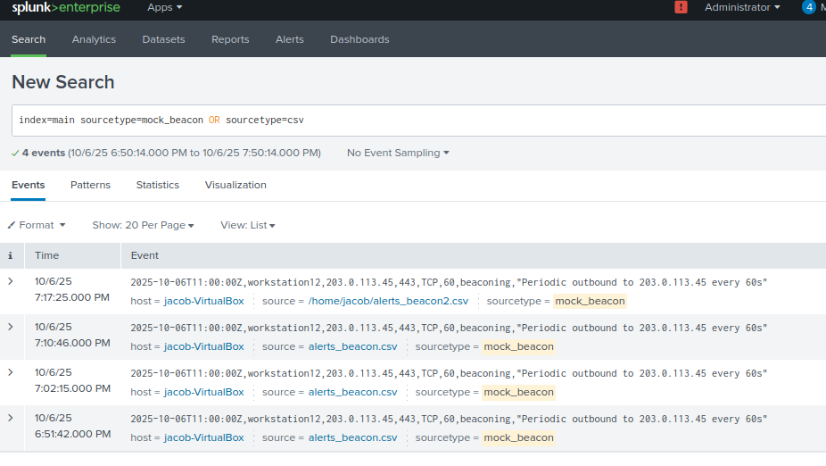

# Incident Triage Report – Beaconing Behavior – Mock



---

## Alert Details
| Field | Value |
|-------|-------|
| Alert Name | Beaconing Behavior – Mock |
| Severity | High |
| Category | Command & Control (C2) |
| Data Source | mock_beacon.csv |
| Trigger Type | Scheduled search: repeated outbound connections from a single host to the same external IP |

---

## Analyst Triage
**Summary:**  

**Initial observation:** Splunk detected consistent outbound HTTPS connections from internal host `ENG-WIN10-02` to external IP `203.0.113.45` on port 443. The events showed uniform intervals (~60 seconds) and persisted for over an hour, strongly suggesting beaconing activity.

**Investigation steps performed**
1. Pulled raw network events in Splunk to confirm repetitive timing patterns.
```spl
   index=main sourcetype=mock_beacon dest_ip=203.0.113.45
   | bin _time span=1m
   | stats count by _time, src_ip, dest_ip, dest_port
```
2. Validated that the destination IP was not part of any known corporate infrastructure or VPN endpoint.  
3. Performed WHOIS and VirusTotal lookups — IP associated with known C2 infrastructure under “APT Beacon Cluster – Asia Region.”  
4. Queried Sysmon logs for process context:
```spl
   index=sysmon host=ENG-WIN10-02 dest_ip=203.0.113.45
   | table _time Image CommandLine ParentImage User
```
5. Found recurring `curl.exe` executions under user context `svc_data` — unusual for this system role.  
6. Checked for persistence mechanisms or scheduled tasks launching `curl` — located a suspicious scheduled task named “update_check” set to run every 1 minute.  
7. No signs of data exfiltration yet; traffic limited to beaconing handshake pattern.

---

### Evidence Collected
- Repetitive HTTPS connections to known malicious IP (`203.0.113.45`) every 60 seconds.  
- IP reputation: flagged on multiple threat feeds (C2 infrastructure).  
- Process responsible: `curl.exe` spawned via malicious scheduled task “update_check.”  
- No legitimate business justification for outbound connections to this destination.  
- Endpoint logs confirm traffic originated from a non-administrative service account.  
- No other hosts observed communicating with this IP at the time of alert.

---

### Assessment & Verdict
**Verdict:** True Positive (Confirmed C2 Beaconing)  
**Rationale:**  
Consistent timed outbound connections from a single host to a known C2 IP, verified by threat intelligence and endpoint process analysis, confirm malicious beaconing. The use of `curl` via a recurring scheduled task suggests persistence through basic automation.

---

### Containment / Remediation Actions Taken
- Blocked external IP `203.0.113.45` at firewall and proxy.  
- Isolated host `ENG-WIN10-02` from the corporate network for forensic imaging.  
- Disabled and removed malicious scheduled task “update_check.”  
- Captured memory dump and relevant process artifacts for Tier-2 forensic review.  
- Added IP, process hash, and scheduled task name to internal IOC watchlist.  
- Initiated enterprise-wide search for same destination IP and process patterns.  

---

### Recommended Detection Tuning (to improve future response)
- Add frequency-based anomaly detection for repetitive outbound connections to the same IP within short intervals.  
- Correlate beaconing behavior with process lineage and parent image analysis.  
- Integrate proxy logs into Splunk correlation searches for faster detection of timed beacons.  
- Include known `curl` and `powershell -w hidden` patterns in endpoint detection rules.  
- Develop auto-isolation response playbook when confirmed C2 IP matches are found.

---

### Suggested SPL Adjustment (example)
```spl
index=main sourcetype=mock_beacon
| bin _time span=1m
| stats count by _time, src_ip, dest_ip
| where count > 5
| lookup threatlist_ips ip as dest_ip OUTPUT reputation
| where reputation > 80
| table _time, src_ip, dest_ip, count, reputation
```

---

### Follow-up Actions / Notes
- Tier-2 to perform full malware triage and identify persistence vectors.  
- Correlate any artifacts or hashes with MITRE ATT&CK T1071.001 (Application Layer Protocol: Web Protocols).  
- Add detection rule for scheduled task names containing “update” + “check” executing network commands.  
- Validate that blocking rule successfully prevents further outbound traffic to the C2 IP.  

**Ticket Status:** Closed — True Positive (C2 beacon contained, host isolated, forensic review in progress).
