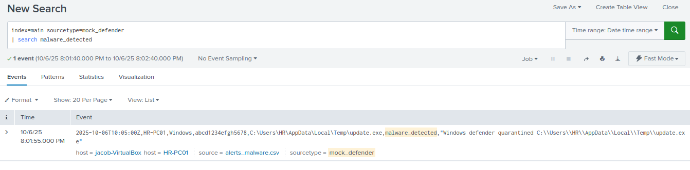

# Incident Triage Report – Malware Detected – Mock



---

## Alert Details
| Field | Value |
|-------|-------|
| Alert Name | Malware Detected – Mock |
| Severity | High (initial) |
| Category | Endpoint Malware Detection |
| Data Source | mock_defender.csv |
| Trigger Type | Real-time: event_type=malware_detected |

---

## Analyst Triage
**Summary:**  

**Initial observation:** Splunk received a Windows Defender event indicating `malware_detected` for file `C:\Users\HR\AppData\Local\Temp\update.exe` on host `HR-PC01`. The detection was flagged as High and the alert fired.

**Investigation steps performed**
1. Pulled the raw event in Splunk and noted fields: `host=HR-PC01`, `file_path=C:\Users\HR\AppData\Local\Temp\update.exe`, `file_hash=abcd1234efgh5678`, `message="Windows defender quarantined ... update.exe"`.

```spl
   index=main sourcetype=mock_defender file_hash=abcd1234efgh5678 | table _time host file_path file_hash message
```

2. Queried endpoint logs for process and user context around the timestamp.
```spl
   index=main host=HR-PC01 (ProcessCreation OR Sysmon) | where _time >= <alert_time-5m> AND _time <= <alert_time+5m>
```
3. Checked the file hash (`abcd1234efgh5678`) against VirusTotal and internal threatlist (performed lookup).

4. Reviewed Defender remediation action: event shows the product **quarantined** the file (not executed or persisted).

5. Contacted the user (owner of `HR-PC01`) for context on recent downloads or patches.

---

### Evidence Collected
- Defender log shows quarantine, not execution.
- VirusTotal / internal lookup: no matches or low/no detection for hash `abcd1234efgh5678`.
- User reported downloading an internal vendor patch installer minutes earlier; filename matches vendor naming convention.
- No suspicious parent process or persistence indicators found in endpoint logs.
- No related network connections or C2 indicators correlated to this host.

---

### Assessment & Verdict
**Verdict:** False Positive (Benign)  
**Rationale:**  
Defender quarantined a file that, based on hash lookups and user confirmation, appears to be a legitimate vendor patch installer saved to a temp folder.  
No corroborating execution, persistence, or external malicious infrastructure was observed.  
Defender’s quarantine appears to be a heuristic or behavioral detection that misclassified an internal installer.

---

### Containment / Remediation Actions Taken
- Confirmed file remains quarantined; no remediation needed to remove active infection.  
- Restored the file to a secure quarantine vault for further analysis by Tier-2 (not restored to endpoint).  
- Notified the user and documented the vendor patch source and timestamp.  
- Added file hash (`abcd1234efgh5678`) to a temporary allowlist for Defender / endpoint agent (or exception path) **after** vendor and Tier-2 confirmation.  
- Closed the ticket as False Positive (documented reasoning) and assigned a short follow-up to Tier-2 for retention of the quarantined artifact.

---

### Recommended Detection Tuning (to reduce future FPs)
- Update the rule to require **additional context** before triggering a high-priority alert, e.g.:
  - Only trigger if `malware_detected` **AND** (`file_hash` in threatintel OR `process_executed=1` OR `network_ioc_seen=1`).
- Add a whitelist check against internal patch repository vendor hashes and known safe temp installers.
- Lower initial severity for `malware_detected` events that are **quarantined** and where `file_hash` is unknown until correlation completes (or classify as low-severity “needs review”).
- Add an automated hash lookup step in the alert action (VirusTotal/internal TI) and escalate only if reputation score > threshold.

---

### Suggested SPL Adjustment (example)
```spl
index=main sourcetype=mock_defender event_type=malware_detected
| lookup threatlist_hashes hash as file_hash OUTPUT reputation
| eval reputation=coalesce(reputation, 0)
| where reputation > 80 OR process_executed=1 OR network_score > 50
```

### Follow-up Actions / Notes
- Tier-2 to retain quarantined file for 7 days for any additional forensic review.  
- If vendor confirms the file is signed and legitimate, add the hash to the permanent allowlist and update the detection whitelist.  
- Document this False Positive in detection tuning notes so the rule can be refined to reduce alert noise.

**Ticket Status:** Closed — False Positive (documented, allowlisted pending vendor confirmation).

