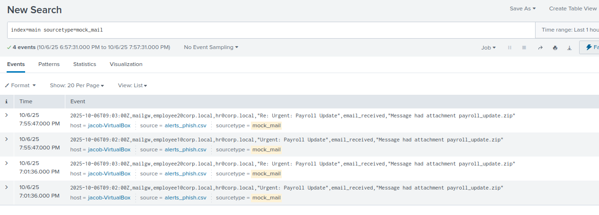

# Incident Triage Report – Phishing Email Campaign – Mock



---

## Alert Details
| Field | Value |
|-------|-------|
| Alert Name | Phishing Email Campaign – Mock |
| Severity | Medium |
| Category | Email Security / Phishing |
| Data Source | mock_mail.csv |
| Trigger Type | Scheduled search detecting identical subjects and sender domains targeting multiple users |

---

## Analyst Triage
**Summary:**  

**Initial observation:** Splunk generated an alert indicating multiple inbound emails with identical subjects and attachments (`payroll_update.zip`) sent from external domain `hr-payroll-update.com`. Several internal users received these emails within a short time window.

**Investigation steps performed**
1. Queried Splunk to identify all affected recipients, sender, and timestamps.
```spl
   index=main sourcetype=mock_mail subject="payroll_update.zip"
   | stats count by recipient, sender, subject
```
2. Pulled full message headers for origin analysis — confirmed SPF and DKIM failures.
3. Extracted the attachment hash and detonated in internal sandbox — observed outbound network connection attempts to `login-verify-hr[.]com`.
4. Checked VirusTotal and internal threat intelligence for domain and hash reputation — both flagged as **malicious phishing infrastructure**.
5. Verified that one recipient opened the ZIP file before automated quarantine completed.
6. Correlated authentication logs for potential credential reuse attempts post-click (none observed yet).

---

### Evidence Collected
- Identical phishing emails with matching subject, sender domain, and attachment.  
- Attachment hash confirmed **malicious** — sandbox showed credential harvesting behavior.  
- Sender domain `hr-payroll-update.com` tied to known phishing campaigns.  
- SPF/DKIM authentication failed on all messages.  
- One user confirmed opening the attachment prior to quarantine.  
- No lateral movement or further compromise detected in endpoint or auth logs.

---

### Assessment & Verdict
**Verdict:** True Positive (Confirmed Phishing Campaign)  
**Rationale:**  
This was a coordinated phishing campaign leveraging spoofed HR branding and a ZIP attachment containing a credential-harvesting payload. The attachment exhibited malicious behavior in sandbox analysis, and the sender domain is verified malicious via external threat intel sources. One user’s interaction increases risk, validating the alert.

---

### Containment / Remediation Actions Taken
- Blocked sender domain `hr-payroll-update.com` in mail gateway and perimeter firewall.  
- Quarantined all matching messages from affected user inboxes via Exchange Admin Center.  
- Forced password resets for impacted accounts and validated MFA compliance.  
- Submitted IOCs (domain, hash, IP) to threat intelligence feed for future correlation.  
- Alerted Security Awareness team to issue phishing advisory to staff.  
- Logged incident for follow-up with IT to confirm no persistence or secondary infection.

---

### Recommended Detection Tuning (to improve future response)
- Add correlation rule for **identical subject lines + external sender domains** within a time window.  
- Create automatic quarantine trigger for high-risk attachment extensions (ZIP, RAR, ISO).  
- Integrate VirusTotal and sandbox results directly into alerting workflow to automate confidence scoring.  
- Enhance mail gateway filters with keyword/domain reputation scoring logic.  
- Tag confirmed phishing campaigns in Splunk for improved threat-hunting metrics.

---

### Suggested SPL Adjustment (example)
```spl
index=main sourcetype=mock_mail
| stats dc(recipient) as unique_targets by subject, sender_domain
| where unique_targets > 3
| lookup threatlist_domains domain as sender_domain OUTPUT reputation
| where reputation > 80 OR attachment_ext IN ("zip","iso","rar")
```

---

### Follow-up Actions / Notes
- Tier-2 to review sandbox network indicators for any beaconing patterns.  
- Add phishing simulation entry to monthly awareness training program.  
- Continue monitoring for reuse of domain or hash in future campaigns.  
- Verify mail filters successfully block test messages from domain post-update.  

**Ticket Status:** Closed — True Positive (Phishing campaign contained; credentials reset; IOCs disseminated).
