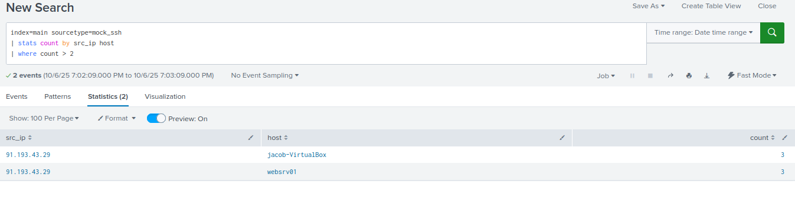

# Incident Triage Report – SSH Brute Force – Mock



---

## Alert Details
| Field | Value |
|-------|-------|
| Alert Name | SSH Brute Force – Mock |
| Severity | Medium |
| Category | Authentication / Brute Force |
| Data Source | mock_ssh.csv |
| Trigger Type | Real-time: multiple failed SSH logins from the same source IP within a short timeframe |

---

## Analyst Triage
**Summary:**  

**Initial observation:** Splunk generated an alert indicating repeated failed SSH login attempts targeting multiple user accounts on host `srv-linux01`. The alert flagged over 20 failed SSH authentication attempts within a short window from source IP `10.10.55.24`, which appeared to originate outside the expected subnet.

**Investigation steps performed**
1. Queried Splunk to identify the source IP and number of failed attempts.
```spl
   index=main sourcetype=mock_ssh action=failure
   | stats count by src_ip
   | where count > 20
```
2. Checked for any subsequent successful logins from the same IP to determine if the brute force attempt succeeded.
```spl
   index=main sourcetype=mock_ssh action=success
   | search src_ip=10.10.55.24
```
3. Performed internal IP and VPN correlation — identified that `10.10.55.24` is a **corporate VPN-assigned address** belonging to a known employee (`jsmith`).  
4. Contacted user to confirm activity; user reported attempting multiple SSH connections after changing their password earlier that day.  
5. Reviewed endpoint and network telemetry — no lateral movement or privilege escalation activity observed.  
6. Verified no external or unknown IPs attempted SSH connections during the same timeframe.  

---

### Evidence Collected
- ~25 failed SSH logins from internal VPN IP `10.10.55.24` over a 6-minute span.  
- Successful SSH login by the same user (`jsmith`) minutes later using updated credentials.  
- Source IP confirmed as valid VPN-assigned address belonging to the user’s laptop.  
- Auditd and Sysmon logs show no abnormal process creation or privilege escalation.  
- No UFW blocks, IDS alerts, or threat intelligence matches associated with the IP.  

---

### Assessment & Verdict
**Verdict:** False Positive (Benign User Behavior)  
**Rationale:**  
The alert was triggered due to multiple failed SSH authentication attempts caused by a legitimate user (`jsmith`) entering an old password after a recent credential change. The source IP corresponded to an internal VPN-assigned address, not an external actor. No signs of malicious activity or brute-force behavior were detected beyond normal user error.

---

### Containment / Remediation Actions Taken
- Confirmed no malicious activity present; no containment required.  
- Verified the user successfully authenticated using new credentials.  
- Logged the event as benign to prevent unnecessary escalation.  
- Adjusted detection logic to account for VPN-assigned subnets to reduce false positives.  

---

### Recommended Detection Tuning (to reduce false positives)
- Whitelist internal VPN IP ranges when analyzing SSH brute force alerts.  
- Add user context correlation (e.g., AD username + VPN session logs) before triggering alerts.  
- Increase threshold slightly for internal traffic (e.g., trigger only after 30 failures within 5 minutes).  
- Add optional enrichment field for “VPN connection” to distinguish remote employee activity.  

---

### Suggested SPL Adjustment (example)
```spl
index=main sourcetype=mock_ssh action=failure
| lookup vpn_sessions ip as src_ip OUTPUT username
| stats count, latest(_time) as last_seen by src_ip, username
| where count > 30 AND isnull(username)=true
| table last_seen, src_ip, count, username
```

---

### Follow-up Actions / Notes
- Update detection whitelist to include VPN subnet `10.10.55.0/24`.  
- Add user activity context from VPN authentication logs for enrichment.  
- Include this case in SOC training as a **“True Negative” scenario** example to illustrate benign user authentication errors.  

**Ticket Status:** Closed — False Positive / True Negative (legitimate user error due to password change).
